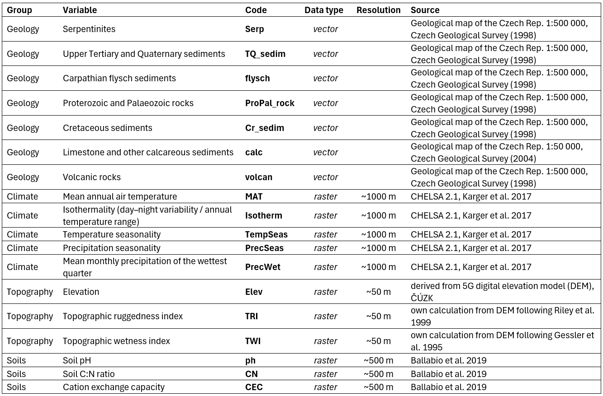

# Introduction

We followed the procedure below to create an environmental stratification scheme for [CzechVeg-OpenStrat](https://czechvegetationdatabase.github.io/Data/czech_veg_openstrat.html), the environmentally stratified version of the Czech Vegetation Database.

As spatial units for the environmental strata, we used the [1 km EEA reference grid for the Czech Republic](https://sdi.eea.europa.eu/catalogue/srv/api/records/9e80fdac-a518-462b-942b-82701035c079f). Each 1 km grid cell was assigned to a stratum based on a combination of environmental variables using principal component analysis (PCA). We then assigned each vegetation plot (N = 116,148) to a stratum based on the grid cell in which it was located. This assignment was subsequently used as one of the criteria in the resampling procedure (described [here](https://czechvegetationdatabase.github.io/DataProcessingTutorial/data_resampling.html)) to prepare a spatially and environmentally balanced, publicly available subset of the Czech Vegetation Database.

```{r}
#| label: Load packages
#| eval: false
# required packages
library(sf)       #
library(terra)
library(dplyr)
library(ggplot2)
library(ggrepel)

# read 1 km grid
cz.grid <- st_read("input_env_data/cz_1km_sstricto.shp")
# reproject coordinate system to WGS 84 (epsg:4326)
cz.grid.wgs <- st_transform(cz.grid, 4326)
```

# Data

For the PCA we used 18 variables relating to geology, climate, topography, and soils.



These variables were selected based on a preliminary PCA of climate variables, correlation analysis (omitting highly correlated predictors), and expert knowledge. For each 1 km grid cell, we calculated the area of geological substrates from vector layers and mean values of other variables from raster layers. Soil rasters from LUCAS contained NoData pixels in some areas of the Czech Republic (typically urban agglomerations or regions with a high density of water bodies); these missing values were interpolated from surrounding cells using a nearest‑neighbour algorithm in ArcGIS Pro.

```{r}
#| label: Load env data
#| eval: false
# read vector and raster layers
geology <- st_read("input_env_data/GeoCR500agg_vapence50_laea.shp")
rasters <- list.files(paste0(getwd(),"/input_env_data/"), pattern = "\\.tif$", full.names = T)
rasters <- lapply(rasters, rast) # list of rasters
```

# PCA

All variables were centered and scaled prior to PCA to have a mean of 0 and a standard deviation of 1. Environmental strata were defined using the first four principal component axes, which together explained 60% of the variation.
